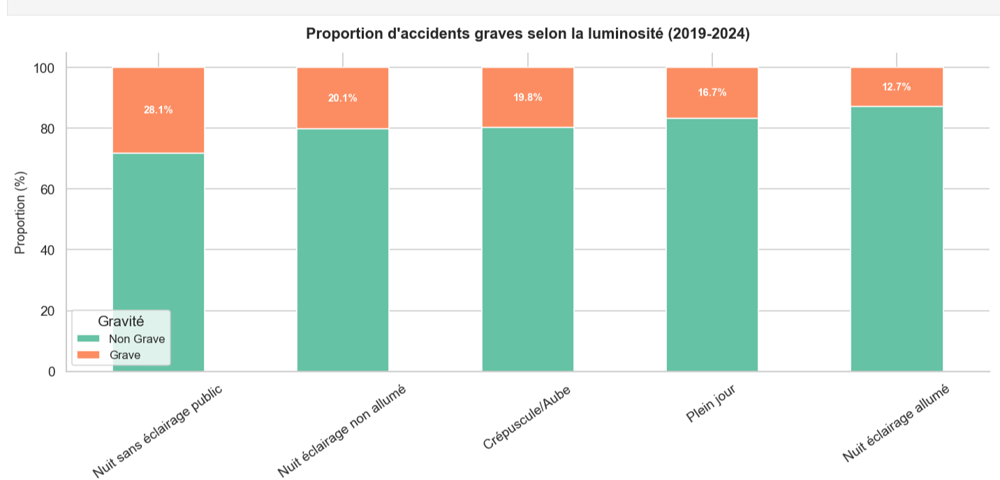
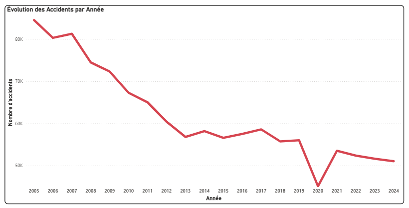
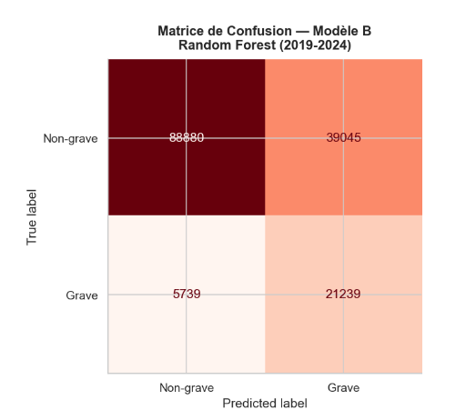
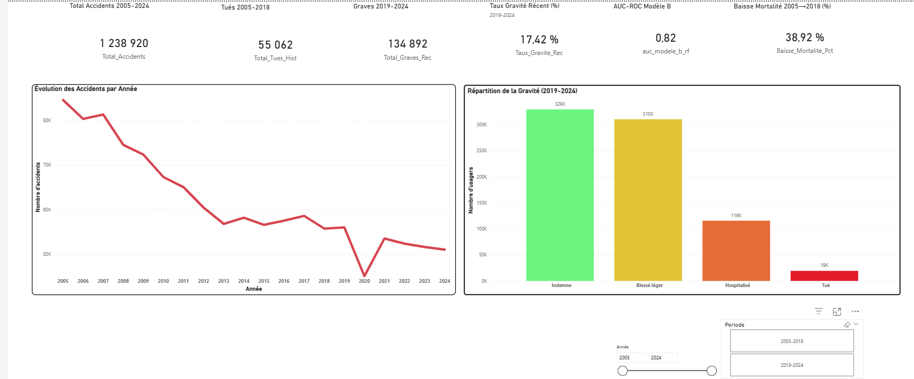
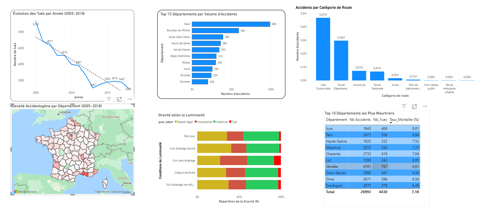
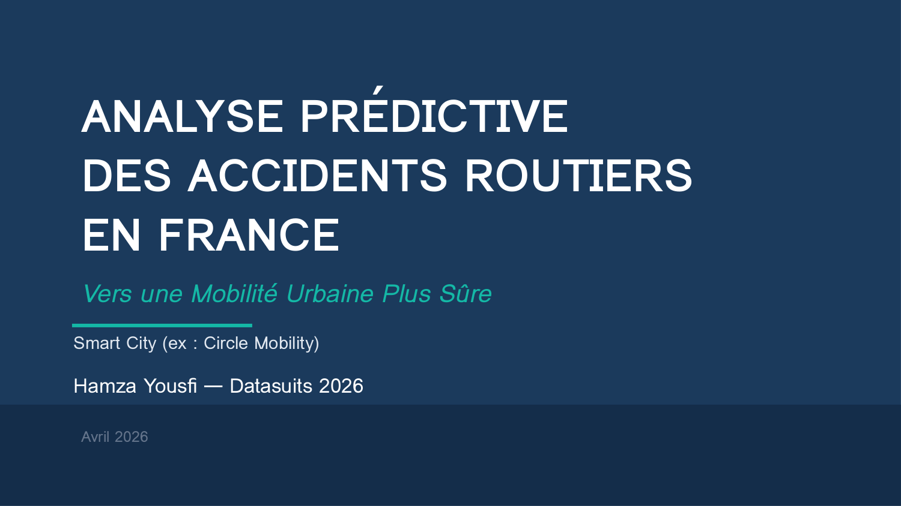

# 🚗 Analyse Prédictive des Accidents Routiers en France (2005-2024)
### Vers une Mobilité Urbaine Plus Sûre — Smart City

<p align="center">
  
  
  
  
  
</p>

---

## 📋 Résumé du Projet

| | |
|---|---|
| **Problématique** | Quels facteurs combinés augmentent le risque d'accident grave, et comment un acteur Smart City peut-il les anticiper ? |
| **Données** | Fichiers BAAC (ONISR) — 80 CSV, 20 ans (2005-2024), France métropolitaine |
| **Volume** | 2 846 028 usagers accidentés après nettoyage |
| **Méthode** | Double modèle Random Forest (rupture ONISR 2019) |
| **Résultat clé** | AUC-ROC > 0.80, Recall ~79% — le modèle détecte 4 accidents graves sur 5 |
| **Livrable** | Notebook Python + Dashboard Power BI 5 pages + Présentation PowerPoint + 5 Recommandations Smart City |

---

## 🎯 Objectifs

1. **Identifier** les facteurs de gravité des accidents routiers (EDA + Feature Importance)
2. **Prédire** la gravité des accidents (Double Modèle Machine Learning)
3. **Recommander** des actions concrètes avec KPIs mesurables pour la mobilité urbaine

---

## 📊 Pipeline Complet

```
Chargement 80 CSV → Jointure 4 tables → Filtre Métropole → Nettoyage 7 étapes
    → EDA → Feature Engineering (8 variables) → Double Modèle ML
        → Dashboard Power BI → Recommandations Smart City
```

### Pourquoi un double modèle ?

L'ONISR a changé son process de saisie en 2019 (rupture de nomenclature). Le label "hospitalisé" n'est plus comparable avant et après 2019. Par rigueur scientifique, j'ai séparé les deux périodes :

| | Modèle A (2005-2018) | Modèle B (2019-2024) |
|---|---|---|
| **Cible** | Tué (grav = 2) | Grave (Tué + Hospitalisé) |
| **Classe cible** | 2.7% (ratio 1:36) | 17.4% |
| **Features** | 12 | 14 (+motor_electrique, +vma_risque) |
| **Dataset** | 2 071 425 usagers | 774 515 usagers |

---

## 🧹 Nettoyage des Données — 7 Étapes

| # | Étape | Résultat |
|---|-------|---------|
| 1 | Suppression doublons exacts | 2 610 supprimés (0.126%) |
| 2 | Suppression grav=-1 et valeurs manquantes | 398 usagers supprimés (période 2019-2024) |
| 3 | Colonnes quasi-vides (>90% NaN) | 9 colonnes supprimées |
| 4 | Imputation âge par médiane | 2 296 NaN → médiane 34 ans |
| 5 | Capping outliers âge >100 | 250 usagers cappés |
| 6 | Remplacement -1 par mode | Valeurs ONISR "Non renseigné" corrigées |
| 7 | Standardisation types numériques | 24 colonnes converties |

> **Perte totale de données < 1%** — Le nettoyage préserve la représentativité statistique.

---

## 🔍 Résultats Clés — EDA

### 5 Facteurs de Risque Structurels (stables sur 20 ans)

| Facteur | Signal Data | Impact |
|---------|-----------|--------|
| 🌙 **Nuit sans éclairage** | Taux gravité 28.1% vs 12.7% nuit éclairée | Risque ×2 |
| 🏞️ **Hors agglomération** | Vitesses élevées + éloignement des secours | Gravité ×2-3 |
| 🚲 **Usagers vulnérables (VRU)** | 29.6% des accidentés, gravité supérieure | Feature #1 Modèle B |
| 👴 **Seniors 65+** | Taux de gravité le plus élevé par tranche d'âge | Population fragile |
| 🌃 **Weekend nocturne** | Combinaison la plus dangereuse | Vendredi/samedi 0h-5h |

### Visualisations

<p align="center">
  <em>Proportion d'accidents graves selon la luminosité (2019-2024)</em>
</p>



<p align="center">
  <em>Évolution des accidents par année (2005-2024) — Dashboard Power BI</em>
</p>



---

## 🤖 Résultats Machine Learning

### Métriques Comparatives

| Métrique | Modèle A (2005-2018) | Modèle B (2019-2024) |
|----------|---------------------|---------------------|
| **AUC-ROC** | 0.8388 ✅ | 0.8164 ✅ |
| **Recall** | 0.7874 ✅ | 0.7873 ✅ |
| **Precision** | 0.0764 ⚠️ | 0.3523 ✅ |
| **F1-Score** | 0.1392 | 0.4868 |
| **CV AUC** | 0.8367 ± 0.0014 | — |

> **Recall ~79%** = le modèle détecte correctement 4 accidents graves sur 5.
>
> **Precision Modèle A faible** : structurel (classe Tué = 2.7%, ratio 1:36). En sécurité routière, le Recall est prioritaire — mieux vaut une fausse alerte qu'un accident mortel non détecté.
>
> **Precision Modèle B ×4.6** : la cible élargie (17.4%) permet un meilleur équilibre.

### Feature Importance — Top 5

**Modèle A (2005-2018) :**
```
agg (agglomération)      ████████████████████████  0.235
col (type collision)     █████████████████        0.175
is_hors_agglo            ██████████████           0.146
age                      █████████                0.092
is_vru                   ████████                 0.081
```

**Modèle B (2019-2024) :**
```
is_vru (usager vulnér.)  ████████████████████████████████  0.324
col (type collision)     ████████████████████     0.196
catv (type véhicule)     ███████████              0.110
is_hors_agglo            ██████████               0.097
agg (agglomération)      ████████                 0.077
```

> **is_vru = facteur n°1 du Modèle B** (score 0.32) — Les usagers vulnérables sont le signal le plus discriminant pour prédire la gravité.

### Matrice de Confusion — Modèle B



---

## 📊 Dashboard Power BI — 5 Pages Interactives

| Page | Contenu |
|------|---------|
| **Vue Générale & KPIs** | 6 KPI Cards, courbe évolution 2005-2024, répartition gravité |
| **Analyse Historique** | Tués par année, Top 15 départements, carte choroplèthe, luminosité × gravité |
| **Profils à Risque** | KPIs gravité, barres empilées 100%, donut VRU |
| **Mobilité Urbaine** | Répartition agglo/hors agglo, motorisation × gravité, Treemap collisions |
| **Modèles ML & Stratégie** | 3 jauges (AUC-ROC, Recall), Feature Importance, recommandations |

**Fonctionnalités :** Slicers dynamiques | Navigation entre pages | Carte choroplèthe | Conditional formatting | Filtrage croisé




---

## 💡 5 Recommandations Smart City

| # | Recommandation | Priorité | KPI Cible |
|---|---------------|----------|-----------|
| 1 | **Alertes géolocalisées** sur tronçons non éclairés la nuit | 🔴 HAUTE | Réduction graves >15% |
| 2 | **API Scoring Risque** par itinéraire (Risk Score 0-10) | 🔴 HAUTE | Risk Score -20% / 6 mois |
| 3 | **Programme VRU** : coaching, voies dédiées, signalement | 🔴 HAUTE | Graves EDP/VAE -20% |
| 4 | **Mobilité Seniors 65+** : ADAS renforcés, parcours adaptés | 🟠 MOYENNE | Gravité 65+ -15% |
| 5 | **Dashboard sécurité temps réel** + alertes weekend nocturne | 🟠 MOYENNE | Couverture >95% |

---

## ⚠️ Limites & Perspectives

### Limites
- **Données déclaratives** : accidents non déclarés absents (sous-estimation VRU)
- **Rupture ONISR 2019** : comparaison avant/après limitée → double modèle
- **Recall ~79%** : 21% de graves non détectés → aide à la décision, pas décideur autonome
- **Variables absentes** : alcoolémie, vitesse réelle, téléphone, fatigue
- **Déséquilibre des classes** : Tué = 2.7% → Precision faible (Modèle A)

### Perspectives
- Enrichissement : Météo-France, trafic TMJA, OpenStreetMap
- Modèles avancés : XGBoost, LightGBM, analyse SHAP pour l'explicabilité
- Déploiement : API REST Flask/FastAPI, scoring temps réel
- Télémétrie : exploitation des capteurs embarqués (vitesse réelle, fatigue)
- Gouvernance : audit de biais algorithmique, conformité RGPD

---

## 🛠️ Stack Technique

| Catégorie | Outils |
|-----------|--------|
| **Langage** | Python 3.12 |
| **Data** | Pandas, NumPy |
| **Machine Learning** | Scikit-Learn (Random Forest, class_weight='balanced') |
| **Visualisation** | Matplotlib, Seaborn |
| **Dashboard** | Microsoft Power BI (DAX, Power Query) |
| **Environnement** | Jupyter Lab |
| **IA Assistante** | Claude (Anthropic) — accélération du développement et debugging |

---

## 📁 Structure du Projet

```
Dataanalyst-Accidents-Routiers-France/
│
├── BAAC_Hamza_Yousfi_Final.ipynb          # Notebook principal (pipeline complet)
├── README.md                        # Ce fichier
│
├── exports_powerbi/                 # 6 CSV exportés pour Power BI
│   ├── data_pbi_historique.csv
│   ├── data_pbi_recents.csv
│   ├── data_pbi_carto.csv
│   ├── data_pbi_kpis.csv
│   ├── data_pbi_feature_importance.csv
│   └── data_pbi_metriques_ml.csv
│
├── images/                          # Captures des résultats
│   ├── luminosite_gravite.png
│   ├── courbe_evolution.png
│   ├── confusion_matrix.png
│   ├── feature_importance.png
│   ├── pbi_vue_generale.png
│   └── pbi_historique.png
│
└── presentation/
    └── BAAC_Hamza_Soutenance.pptx   # PowerPoint de soutenance (20 slides)
```

---

## 🗣️ Présentation PowerPoint

Retrouvez la synthèse du projet et les recommandations clés dans la présentation PowerPoint :



---

## 📥 Données Source

Les données BAAC sont publiques et disponibles sur [data.gouv.fr](https://www.data.gouv.fr/fr/datasets/bases-de-donnees-annuelles-des-accidents-corporels-de-la-circulation-routiere/).

Téléchargez les fichiers annuels de 2005 à 2024 (4 tables par année : caractéristiques, lieux, véhicules, usagers).

---

## 🚀 Reproduction

```bash
# 1. Cloner le repo
git clone https://github.com/hamzayousfiparis/Dataanalyst-Accidents-Routiers-France.git
cd Dataanalyst-Accidents-Routiers-France

# 2. Installer les dépendances
pip install pandas numpy scikit-learn matplotlib seaborn

# 3. Télécharger les données BAAC sur data.gouv.fr (80 CSV, 2005-2024)

# 4. Lancer le notebook
jupyter lab BAAC_Hamza_Yousfi_Final.ipynb

# 5. Exécuter toutes les cellules (Run All)
# Les 6 CSV Power BI seront générés automatiquement dans exports_powerbi/
```

---

## 👤 Auteur

**Hamza** — Data Analyst  
Formation Datasuits 2026  
Projet orienté Smart City & Mobilité Urbaine

---

## 📄 Licence

Ce projet est à usage éducatif et professionnel. Les données BAAC sont publiées sous Licence Ouverte par l'ONISR.

